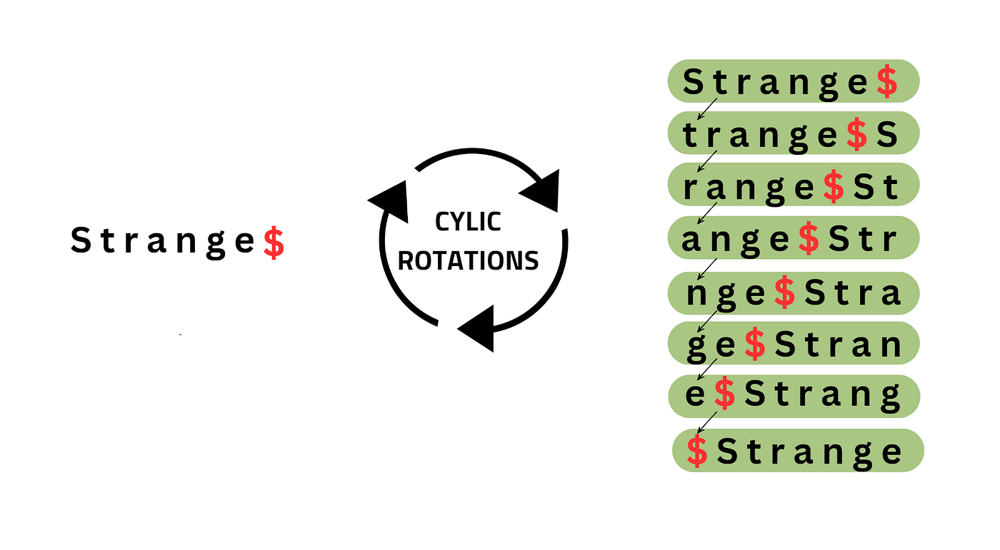
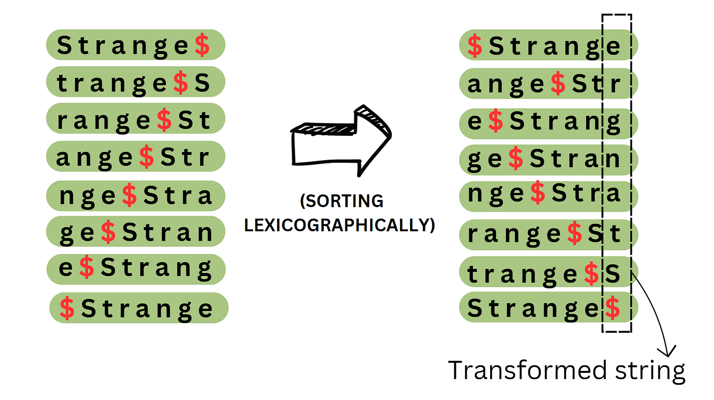

+++
title = 'Burrows-Wheeler Transform'
date = 2025-11-02T10:00:00+04:00
tags = [ "go", "BWT", "burrows_wheeler", "strings", "algorithms" ]

draft = true
+++

Burrows-Wheeler Transformation (BWT) - один из самых интересных алгоритмов, на мой взгляд. Он имеет широкое применение в биоинформатике (поиск шаблонов по геному), сжатии данных (bzip2), индексирование текста (FM-Index) и во многих других областях.

В данной статье, я постараюсь продемонстрировать применение BWT для задачи поиска множества шаблонов в большом тексте, описаны оптимизации, рассмотрена конкурентная реализация, а так же проведены бенчмарки версии без оптимизации, с оптимизациями и параллельной реализации в задаче поиска текста.

## Описание

BWT оперирует понятием циклического сдвига. Это скорее ментальное понятие, чем что-то реально существующее в коде. При циклическом сдвиге на 1 мы удаляем 1 символ из начала строки и добавляем его в конец. При циклическом сдвиге 2 - так же поступаем в 2-мя символами. Если величина сдвига превышает длину строки - берем остаток от деления.

## Постороение

1. На первом шаге алгоритма генерируем все возможные циклические сдвиги (явно в коде этого делать не нужно будет)

2. Сортируем полученные циклические сдвиги лексикографически

3. Последний столбец и является искомым BWT

Также часто сохраняется индекс исходной строки для обратного преобразования.

### Суффиксный массив

## Поиск

Одно из замечательных свойств BWT - это возможность искать образец текста в большом тексте за время, пропорциональное длине образца, но не самого текста. 

backward search

## FM-Index

### Аналогия с Trie

Ахо-Корасик

## Optimisations

### bitvector rank

### 

### batch search

## Concurrency

## Benchmarks

## References

1. coursera
2. youtube russian man
3. https://www.cs.jhu.edu/~langmea/resources/lecture_notes/bwt_and_fm_index.pdf
4. https://www.cs.helsinki.fi/u/tpkarkka/opetus/12s/spa/lecture11.pdf
5. https://www.geeksforgeeks.org/dsa/burrows-wheeler-data-transform-algorithm/
6. https://medium.com/@sharonolivia_chintala/burrows-wheeler-transformation-algorithm-a7b13d144f58
7. 

