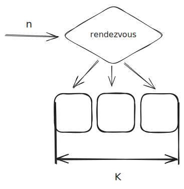

+++
title = 'Consistent and Rendezvous Hashing'
date = 2025-08-17T10:00:00+04:00
tags = [ "dsa", "consistent", "rendezvous", "hashing", "go" ]

draft = true
+++

## Rendezvous hashing

**Rendezvous hashing, Highest Random Weight hashing, HRW** - это алгоритм взятия хеша, который стремится минимизировать изменение в распределении потребителей узлов (подписчиков, клиентов) при увеличении/уменьшении их числа. Подобно консистентному кешированию HRW ставит в соответствие набору входных данных некоторое всегда одинаковое число (при условии неизменных настроек), однако в отличие от него для этого использует константный объем памяти.  

На вход этому алгоритму поступает какое-то число (заранее взятый быстрый хеш, вроде murmur3, xxhash) и количество бакетов (узлов, шардов и так далее). Данный алгоритм  ставит в соответствие переданное число `n` в бакет под номером `k`, причем делает это таким образом, что при изменении числа бакетов соответствие переданного числа бакету стремиться не меняться. Данный алгоритм не использует ring key buffer, в отличие от консистентного хеша.



При использовании rendezvous hash примерно 1/N ключей будут перераспределены при добавлении/удалении ключа. В случае с consistent hash это примерно 10-15%.

## Consistent Hashing

// TODO нарисовать key ring

// TODO нарисовать vnodes

Для начала стоит рассмотреть консистентное кеширование, чтобы понять решаемую проблему. 

При Consistent Hashing для начала мы вычисляем хеши для каждого узла, сохраняем их в отсортированном виде в массив - строим кольцо ключей.

Затем, когда нам нужно получить соответствие ключу его узла, просто ищем бинпоиском позицию большую или равную ключу узла.

```go
type ringPoint struct {
	hash int64
	node string
}

func buildRing(nodes []string) []ringPoint {
	var ring []ringPoint
	for _, node := range nodes {
		nodeHash := sha1Sum(node)
		ring = append(ring, ringPoint{nodeHash, node})
	}
	slices.StableSort(ring, func(i, j int) bool {
		return ring[i].hash > ring[j].hash
	})
	return ring
}

func ConsistentHash(key string, ring []ringPoint) string {
	keyHash := sha1Sum(key)

	idx := sort.Search(len(ring), func(i int) bool {
		return ring[i].hash >= keyHash
	})
	if idx == len(ring) {
		idx = 0
	}
	return ring[idx].node
}
```

Основной недостаток такой прямолинейной реализации в том, что ключи узлов распределяются на кольце произвольным образом - не равномерно. Кроме того, например, при добавлении узла в кольцо ключей, он добавляется между 2-мя последовательными узлами, перераспределяя в себя некоторое количество последовательных хешей, что может быть не всегда удобно на практике.

Чтобы избежать этого недостатка добавим понятие виртуальных ключей (vnodes). Для этого сделаем сопоставление 2-го подрядка - для каждого реального узла добавим несколько 100 виртуальных ключей. Количество vnodes для каждого реального узла одинаковое. Распределение хешей vnodes так же произвольное, но за счет того, что их много и интервалы между ними маленькие распределение теперь будет около равномерным.

```go
type HashRing struct {
	replicas int                
	keys     []uint32            
	hashMap  map[uint32]string 
}

func (h *HashRing) AddNode(node string) {
	for i := 0; i < h.replicas; i++ {
		vnodeID := fmt.Sprintf("%s#%d", node, i)
		hash := hashKey(vnodeID)

		h.keys = append(h.keys, hash)
		h.hashMap[hash] = node
	}
	slices.StableSort(h.keys, func(i, j int) bool { return h.keys[i] < h.keys[j] })
}
func (h *HashRing) RemoveNode(node string) {
	newKeys := h.keys[:0]

	for _, k := range h.keys {
		if h.hashMap[k] == node {
			delete(h.hashMap, k)
			continue
		}
		newKeys = append(newKeys, k)
	}

	h.keys = newKeys
}
func (h *HashRing) GetNode(key string) string {
	if len(h.keys) == 0 {
		return ""
	}

	hash := hashKey(key)
	idx := sort.Search(len(h.keys), func(i int) bool {
		return h.keys[i] >= hash
	})

	if idx == len(h.keys) {
		idx = 0
	}

	return h.hashMap[h.keys[idx]]
}
```

## WRH - Weighted Rendezvous Hashing

В отличие от консистентного кеша рандеву не хранит кольцевой буфер. Вместо этого он миксует ключ, для которого ищется узел (бакет) и имя этого узла и для каждого из узлов находит значение хеша. Среди всех таких значений выбирается максимальное, которое и выбирается как значение бакета для ключика (его остаток от деления).

Пример простейшей реализации рандеву хеша:

```go
func rendezvousHash(key string, nodes []string) string {
	var maxHash int64
	var chosen string

	for _, node := range nodes {
		keyNodeHash := sha1Sum(key + node)
		if chosen == "" || keyNodeHash > maxHash {
			maxHash = keyNodeHash
			chosen = node
		}
	}
	return chosen
}

```

Почему это работает? Максимум - это точечная операция, не использующая данные о других узлах.

Когда добавляется новый узел перераспределяются в него только те ключики, для которых хеш с этим узлом стал максимальным. То же самое происходит при удалении узла. Если перед удалением хеш ключика не был максимален с данным узлом, то этот ключик не будет перераспределен.

При этом, в отличие от консистентного кеша, не нужно пересчитывать кольцо и не происходит массовых перестановок.

Из-за равномерного распределения хешей мы имеем что и максимальное значение так же будет равномерно распределено.

Главный недостаток randezvous по сравнению с consistent hashing заключается в необходимости вычисления хеша по каждому узлу при вычислении бакета для ключа. В consistent hashing нам достаточно 1 раз вычислить хеш ключика + предварительно вычислить hash nodes/vnodes. Для большого количества узлов мы будем иметь линейное увеличение нагрузки для вычисления каждого бакета по ключу.

Так же поиск в кольце хешей выполняется через бинпоиск, тогда как в рандеву поиск линеен, что так же может сыграть свою роль при увеличении количества узлов.

В consistent hashing вы можете распределить vnodes неравномерно так, чтобы на некоторые узлы нагручка приходила больге, чем на остальные (горячие ключи). В randezvous так сделать нельзя.

## Применение randezvous

// TODO more examples

// TODO scenarios 

1. redis-go для выбора узла в shardedClient
2. nginx (where?)
3. 

## Применение consistent hashing

// TODO scenarios

1. Apache Kafka
2. Apache Cassandra
3. Raik

----

## Referencies

1. https://medium.com/my-games-company/comparing-consistent-vs-rendezvous-hashing-for-hashing-server-data-9e90dfe51740
2. https://habr.com/ru/companies/mygames/articles/669390/
3. https://randorithms.com/2020/12/26/rendezvous-hashing.html
4. https://pvk.ca/Blog/2017/09/24/rendezvous-hashing-my-baseline-consistent-distribution-method/
5. https://www.eecs.umich.edu/techreports/cse/96/CSE-TR-316-96.pdf
6. https://github.com/dgryski/go-rendezvous/blob/master/rdv.go
