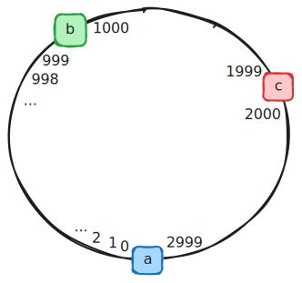
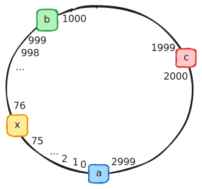
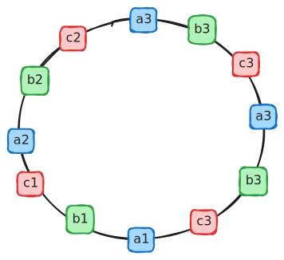
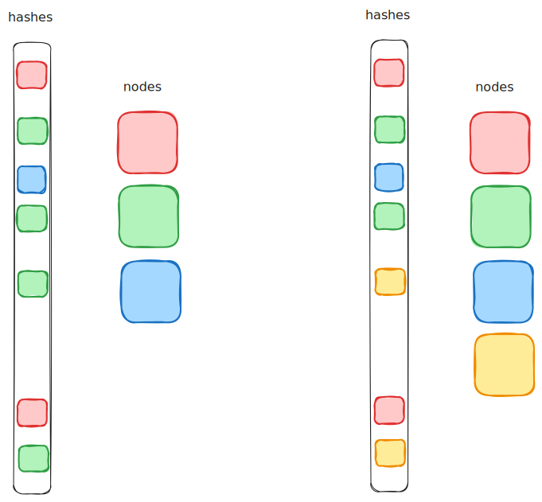
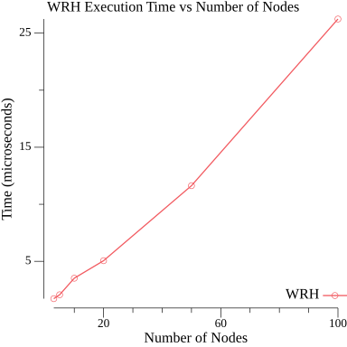
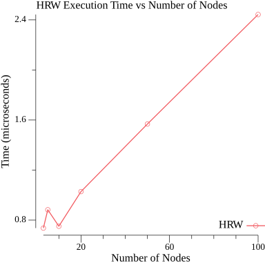
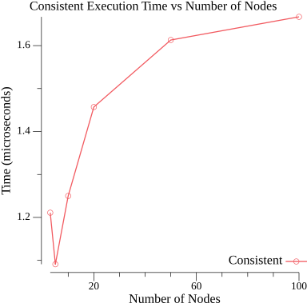

+++
title = 'Consistent and Rendezvous Hashing'
date = 2025-08-17T10:00:00+04:00
tags = [ "dsa", "consistent hashing", "hash ring", "rendezvous", "hashing", "go" ]
+++

## Consistent and Rendezvous Hashing

В распределенных системах частой задачей является распределение данных (запроса, сообщения) к определенному, детерминированному узлу. Это применяется в базах данных, в системах передачи сообщений, в системах кеширования данных и работы с ними, в балансировщиках нагрузки и других компонентах распределенных систем. Чтобы выполнить равномерное распределение или распределение с учетом весов не достаточно произвольным образом по хешу (`hash mod N`) отправить их на нужный узел, ведь в этом случае, при добавлении нового узла мы получим значительное перераспределение хешей. Чтобы минимизировать такое перераспределение тут рассматриваются 2 механизма - консистентное хеширование и rendezvous хеш.

В данной статье не рассматриваются другие стратегии детерминированного выбора хешей, такие как `maglev` или `jump hash`.

## Consistent Hashing

При Consistent Hashing мы строим кольцо хешей (hash ring). Для этого мы сначала берем какое-то большое число N (как правило 2^32-1). При получении кеша мы его отображаем на интервал \[0..2^32-1\], то есть берем остаток от деления хеша на N. Для построения hash ring мы вычисляем хеши для каждого узла, сохраняем их в отсортированном виде в массив - строим кольцо ключей.



Затем, когда нам нужно получить соответствие ключу его узла, просто ищем бинпоиском позицию большую или равную ключу узла (ищут узел, которому принадлежит кеш по часовой стрелке в кольце ключей).

```go
type ringPoint struct {
	hash int64
	node string
}

func buildRing(nodes []string) []ringPoint {
	var ring []ringPoint
	for _, node := range nodes {
		nodeHash := sha1Sum(node)
		ring = append(ring, ringPoint{nodeHash, node})
	}
	slices.StableSort(ring, func(i, j int) bool {
		return ring[i].hash < ring[j].hash
	})
	return ring
}

func ConsistentHash(key string, ring []ringPoint) string {
	keyHash := sha1Sum(key)

	idx := sort.Search(len(ring), func(i int) bool {
		return ring[i].hash >= keyHash
	})
	if idx == len(ring) {
		idx = 0
	}
	return ring[idx].node
}
```

Основной недостаток такой прямолинейной реализации в том, что ключи узлов распределяются на кольце произвольным образом. При добавлении нового узла, он добавляется между двумя существующими узлами и "забирает" часть хешей следующего по часовой стрелке узла на себя. Получаем, что часть хешей теперь распределяется неравномерно между новым узлом `x` и узлом `b`. Таким образом, мы имеем следующие недостатки:
1. при количестве узлов K, количество перераспределенных кешей равно n/K (где n - количество уже вычисленных кешей на момент добавления нового узла)
2. при добавлении нового узла, он добавляется в произвольную точку, беря на себя часть произвольную часть кешей от одного из узлов. Это может вызвать неравномерную нагрузку на узлы.




Чтобы избежать этих недостатков (вернее минимизировать их) добавим понятие виртуальных ключей (vnodes). Для этого сделаем сопоставление 2-го порядка - для каждого реального узла добавим несколько, например, 100 виртуальных ключей. Количество vnodes для каждого реального узла одинаковое. Распределение хешей vnodes так же произвольное, но за счет того, что их много и интервалы между ними маленькие каждый раз добавляя новый виртуальный узел мы перераспределяем количество хешей не n/K (как в предыдущем случае), а n/(100\*K), то есть в 100 раз меньше.

При добавлении нового узла (то есть некоторого количества виртуальных узлов на hash ring) мы может "размазать" нагрузку на перераспределение кешей по времени, добавляя виртуальные узлы с некоторой задержкой. Это так же делает меньше блокировку узлов (fine-grained lock). Кроме того, теперь при добавлении нового узла, хеши на него распределяются из разных существующих узлов - это делает распределение хешей относительно равномерным по узлам. 



```go
type HashRing struct {
	replicas int                
	keys     []uint32            
	hashMap  map[uint32]string 
}

func (h *HashRing) AddNode(node string) {
	for i := 0; i < h.replicas; i++ {
		vnodeID := fmt.Sprintf("%s#%d", node, i)
		hash := hashKey(vnodeID)

		h.keys = append(h.keys, hash)
		h.hashMap[hash] = node
	}
	slices.StableSort(h.keys, func(i, j int) bool { return h.keys[i] < h.keys[j] })
}
func (h *HashRing) RemoveNode(node string) {
	newKeys := h.keys[:0]

	for _, k := range h.keys {
		if h.hashMap[k] == node {
			delete(h.hashMap, k)
			continue
		}
		newKeys = append(newKeys, k)
	}

	h.keys = newKeys
}
func (h *HashRing) GetNode(key string) string {
	if len(h.keys) == 0 {
		return ""
	}

	hash := hashKey(key)
	idx := sort.Search(len(h.keys), func(i int) bool {
		return h.keys[i] >= hash
	})

	if idx == len(h.keys) {
		idx = 0
	}

	return h.hashMap[h.keys[idx]]
}
```

## Rendezvous hashing

**Rendezvous hashing, HRW (Highest Random Weight) hashing** - это алгоритм взятия хеша, который стремится минимизировать изменение в распределении потребителей узлов (подписчиков, клиентов) при увеличении/уменьшении их числа. Подобно консистентному кешированию HRW ставит в соответствие набору входных данных некоторое всегда одинаковое число (при условии неизменных настроек), однако в отличие от него не требуется хранение кольцевого буфера виртуальных узлов.  

На вход этому алгоритму поступает какое-то число (заранее взятый быстрый хеш, вроде murmur3, xxhash) и количество бакетов (узлов, шардов и так далее). Данный алгоритм  ставит в соответствие переданное число `n` в бакет под номером `k`, причем делает это таким образом, что при изменении числа бакетов соответствие переданного числа бакету стремиться не меняться. 


При использовании rendezvous hash примерно 1/N ключей будут перераспределены при добавлении/удалении ключа.

В отличие от консистентного кеша rendezvous не хранит кольцевой буфер. Вместо этого он миксует ключ, для которого ищется узел (бакет) и имя этого узла и для каждого из узлов находит значение хеша. Среди всех таких значений выбирается максимальное, которое и выбирается как значение бакета для ключика (его остаток от деления).

Пример простейшей реализации rendezvous хеша:

```go
func FindNode(key string, nodes []string) string {
	var maxHash int64
	var chosen string

	for _, node := range nodes {
		keyNodeHash := sha1Sum(key + node)
		if chosen == "" || keyNodeHash > maxHash {
			maxHash = keyNodeHash
			chosen = node
		}
	}
	return chosen
}

```

Почему это работает? Максимум - это точечная операция, не использующая данные о других узлах.

Когда добавляется новый узел перераспределяются в него только те ключики, для которых хеш с этим узлом стал максимальным. То же самое происходит при удалении узла. Если перед удалением хеш ключика не был максимален с данным узлом, то этот ключик не будет перераспределен.

При этом, в отличие от консистентного кеша, не нужно пересчитывать кольцо и не происходит массовых перестановок.

Из-за равномерного распределения хешей мы имеем что и максимальное значение так же будет равномерно распределено.

Если же у вас есть неравномерное распределение, то при добавлении нового узла оно стремится распределится  равномернее за счет того, что по сути некоторый произвольный существующий ключ переходит на новый узел. Если для какого-то из узлов мы имеем больше хешей, чем для остальных, то мы можем ожидать, что и большее количество таких хешей перейдет на новый узел. То есть при таком подходе, система сама стремится выровнить распределение. 

Например, на картинке ниже мы имеем больше "зеленых" хешей, чем остальных. При добавлении нового "желтого" узла, мы вероятнее "перекрасим" больше зеленых узлов, просто потому, что их больше, а мат. ожидание выбора равномерное.



Главный недостаток randezvous по сравнению с consistent hashing заключается в необходимости проверки хеша по каждому узлу при вычислении бакета для ключа. В consistent hashing нам достаточно 1 раз вычислить хеш ключика + предварительно вычислить hash nodes/vnodes. Для большого количества узлов для rendezvous мы будем иметь линейное увеличение нагрузки для вычисления каждого бакета по ключу. Впрочем, эта нагрузка сильно оптимизируется на уровне процессора для HRW версии (см. бенчмарки ниже).

Чтобы уменьшить количество вычислений в отличие от прямолинейной функции, представленной выше использовать операцию `XOR` для хешей. Тогда можно вычислить хеш ключа 1 раз и не аллоцировать память на канкатенацию строк. Кроме того, можно вычислять хеш узла так же один раз при его добавлении.

```go
func (h *HRW) FindNode(key []byte) *HRWNode {
	var (
		resNode  *HRWNode
		maxScore uint64
	)

	hKey := xxhash.Sum64(key)
	for _, node := range h.nodes {
		score := node.hash ^ hKey

		if score > maxScore {
			maxScore = score
			resNode = node
		}
	}

	return resNode
}
```

Так же поиск в кольце хешей выполняется через бинпоиск - O(log N) - тогда как в rendezvous поиск линеен, что так же может сыграть свою роль при увеличении количества узлов.

Если, при этом, мы сопоставим каждому узлу его вес и будем распределять хеши в соответствии с этим весом, то такая версия алгоритма называется **WRH (Weighted Rendezvous Hashing)**

```go
func score(hash uint64, weight float64) float64 {  
    u := float64(hash+1) / float64(math.MaxUint64)  
    return -math.Log(u) * weight  
}  
  
func (h *WHR) FindNode(key []byte) *WHRNode {  
    var (  
       resNode  *WHRNode  
       maxScore float64  
    )  
  
    hKey := xxhash.Sum64(key)  
    for _, node := range h.nodes {  
       s := score(node.hash ^ hKey, node.weight)  
  
       if s > maxScore {  
          maxScore = s  
          resNode = node  
       }  
    }  
  
    return resNode  
}
```

## Benchmarks

Тест бенчмарка - выполнить поиск узла для 10 миллионов ключей. Для каждого бенча меняется количество узлов: 3, 5, 10, 20, 50, 100. 

[исходный код бенчмарков](https://github.com/swvitaliy/goalgo/blob/main/hashes/hashes_test.go)

[результаты выполнения на гитхаб](https://github.com/swvitaliy/goalgo/blob/main/hashes/bench_results_10M.txt)

Использование алгоритма распределения **rendezvous по взвешенным узлам (WRH)** дает линейный рост времени поиска узла от количества этих узлов. 



Использование алгоритма распределения **HRW (не взвешенный)** дает так же линейный рост времени поиска узла при увеличении количества узлов от 3 до 100. Однако абсолютные значения времени отличаются на порядок. Вероятно, на производительность WRH повлияло наличие операций деления чисел с плавающей точкой и взятие логарифма.



При использовании **консистентного хеша** время поиска зависит логарифмически от количества узлов. При увеличении от 3 до 100 время изменилось от 1.1 сек. до 1.6 сек и рост при этом почти остановился. 



Интересно так же, что при использовании консистентного хеша в тестах на равномерность распределения пришлось поставить Eps=0.1 в случае, когда количество узлов равно 3-м, тогда как обе rendezvous реализации имеют в аналогичных тестах Eps=0.01 (в случае 100 узлов для консистентного кеша eps так же равно 0.01). Это указывает на то, что даже при использовании vnodes в hash ring равномерность распределения ключей в случае малого количества узлов хуже чем для rendezvous и прилично отличается от равномерной - до 10% для фактора репликации 100 (количество vnodes на один узел). 

## Применение consistent hashing

В качестве примера применения consistent hashing рассмотрим реализацию выбора узла в nginx
([ngx_http_upstream_hash_module.c](https://github.com/nginx/nginx/blob/master/src/http/modules/ngx_http_upstream_hash_module.c)).

В конфигурации upstream можно указать:

```nginx
upstream backend {
    hash $request_uri consistent;
    server backend1.example.com;
    server backend2.example.com;
    server backend3.example.com;
}
```

Директива `hash` с флагом `consistent` включает consistent hashing по заданному ключу (в данном случае — URI запроса). Это гарантирует, что один и тот же URI всегда попадает на один и тот же сервер, что особенно полезно для кеширующих прокси: при добавлении или удалении узла перераспределяется только часть ключей, а не все сразу.

Без флага `consistent` nginx использует простой `hash mod N`, что при изменении числа серверов приводит к массовому инвалидированию кеша.

## Применение rendezvous

В качестве примера применения rendezvous рассмотрим реализацию
[go-rendezvous](https://github.com/dgryski/go-rendezvous/blob/master/rdv.go) от Damian Gryski, которая используется в клиенте [go-redis](https://github.com/redis/go-redis) для выбора узла в кластере.

Ключевая идея реализации та же: для каждого узла вычисляется хеш пары (ключ, узел), выбирается узел с максимальным значением. За счёт использования быстрой хеш-функции (maphash) и отсутствия аллокаций реализация показывает высокую производительность при небольшом числе узлов — типичном для Redis-кластеров.

## Итог

Оба алгоритма минимизируют перераспределение данных при изменении числа узлов, но с разными трейдофами.

**Consistent hashing** — работает за O(log N), но требует кольцевого буфера vnodes и даёт худшую равномерность распределения.

**Rendezvous hashing** — лучшая равномерность и легко сделать поддержку весов (WRH), но поиск линейный O(N).

## References

1. https://medium.com/my-games-company/comparing-consistent-vs-rendezvous-hashing-for-hashing-server-data-9e90dfe51740
2. https://habr.com/ru/companies/mygames/articles/669390/
3. https://randorithms.com/2020/12/26/rendezvous-hashing.html
4. https://pvk.ca/Blog/2017/09/24/rendezvous-hashing-my-baseline-consistent-distribution-method/
5. https://www.eecs.umich.edu/techreports/cse/96/CSE-TR-316-96.pdf
6. https://github.com/dgryski/go-rendezvous/blob/master/rdv.go
7. https://github.com/nginx/nginx/blob/master/src/http/modules/ngx_http_upstream_hash_module.c
