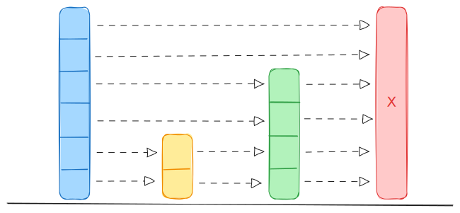
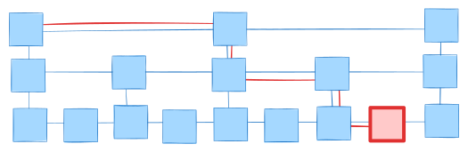

+++
title = 'Skip-list'
date = 2024-01-14T08:07:07+04:00
tags = [ "dsa", "skip-list", "go" ]
+++

Skip-list - это **вероятностная структура данных**, похожая по функционалу на сбалансированные деревья поиска, однако отличается от них тем, что не имеет явного этапа балансировки. Это позволяет реализовать конкурентную версию skip-list без глобальной блокировки всей структуры данных. Более того, возможна эффективная и довольно простая lock-free реализация. В данной статье представлены несколько демонстрационных реализаций skip-list на `go` (single thread, concurrent lock-free), а так представлена особенность реализации операции вставки в redis (spans).
## Описание структуры данных

Каждый узел представляет из себя узел связного списка. Вместо указателя `Next` на следующий элемент массив таких указателей. В данном массиве в элементе `Next[i]` содержится указатель на следующий элемент i-го уровня. Размер этого массива является вероятностной величиной, ограниченной некоторым значением.

```go
const (  
    p        = 0.5
    maxLevel = 16
)  
  
type Key cmp.Ordered  
type Value any

type Node[K Key, V Value] struct {  
    key   K  
    value V  
    next  []*Node[K, V]  
}
```

При создании узла ему выделяется значение уровня от 1 до `maxLevel`. Причем, с вероятностью 50% берется уровень 1, с вероятностью 25% - уровень 2 и так далее до последнего уровня (уровень узла - индекс в массиве next его предка).

```go
func randomLevel() uint64 {  
    var lvl uint64 = 1  
    for rand.Float64() < 0.5 && lvl < maxLevel {  
       lvl++  
    }  
    return lvl  
}
```

Для данной реализации и вероятности 0.5 получим вероятность попадания узла на уровень k равен 0.5^k.



За счет того, что уровень узла выбирается таким образом, структура получается "деревянной" и в среднем остается сбалансированной.

Отдельно нужно хранить номер верхнего уровня для всей структуры `SkipList`, чтобы начинать поиск из этого уровня.

```go
type SkipList[K Key, V Value] struct {  
    level uint64  
    head  *Node[K, V]
}
```

## Операции

### Поиск

Поиск так же выполняется в операциях удаления и вставки.



При поиске элемента мы начинаем с верхнего уровня ссылок, переходя от элемента к элементу на этом уровне до тех пор пока не наткнемся на нулевой указатель или на подходящий элемент (больший или равный искомому). После чего спускаемся на уровень ниже до тех пор, пока есть куда спускаться. 

```go
func (sl *SkipList[K, V]) SearchNode(target K) *Node[K, V] {  
    node := sl.head
    for i := sl.level - 1; i >= 0; i-- {  
       for node != nil && node.next[i].key < target {  
          node = node.next[i]
       }  
    }
```

Если элемент равен искомому, то возвращаем его. В противном случае, возвращаем нулевой указатель.

Почему можно безопасно перемещаться по всей skip list структуре?

При поиске мы идем слева направо, сверху вниз. Если даже какой-то элемент был добавлен он не поменяет порядка уже существующих элементов. Поиск все рано найдет нужный узел.

### Вставка

При вставке в skip-list сначала мы формируем путь поиска, по которому мы идем из head к искомому элементу (массив `update`).

```go
func (sl *SkipList[K, V]) Insert(key K, value V) *Node[K, V] {  
    update := make([]*Node[K, V], maxLevel)  
    node := sl.head  
    for i := sl.level - 1; i >= 0; i-- {  
       for node != nil && node.next[i].key < key {  
          node = node.next[i]  
       }  
       update[i] = node  
    }  
  
    if node == nil {  
       return nil  
    }
```

Если найден ключ равный искомому - обновляем значение и выходим

```go
node = node.next[0]  
if node != nil && node.key == key {  
    node.value = value  
    return node  
}
```

Если уровень элемента выше, чем верхний уровень в голове - обновляем верхний уровень в голове и добавляем в верхние уровни пути узел головы. 

```go
lvl := randomLevel()  
if lvl > sl.level {
    for i := sl.level; i < lvl; i++ {  
       update[i] = sl.head  
    }  
    sl.level = lvl  
}
```

Создаем новый узел, ссылки из предыдущих элементов на следующие устанавливаем на этот новый узел. Ссылки на следующие элементы устанавливаем для этого нового узла

```go
newNode := &Node[K, V]{  
    key:   key,  
    value: value,  
    next:  make([]*Node[K, V], lvl),  
}  
for i := uint64(0); i < lvl; i++ {  
    newNode.next[i] = update[i].next[i]  
    update[i].next[i] = newNode  
}
```

В момент вставки нового элемента длина списка ссылок (а значит пропусков) определяется случайным образом с уменьшением вероятности попасть на уровень выше. Поэтому статистически при большом количестве вставок поиск по этой структуре данных работает за log(N), как и операции вставки и удаления, которые содержат в себе поиск.

### Удаление

При удалении нам так же как и при вставке нужно сначала найти удаляемый элемент и сформировать массив элементов, которые следует обновить

```go
func (sl *SkipList[K, V]) Delete(key K) bool {  
    update := make([]*Node[K, V], maxLevel)  
    node := sl.head  
    for i := sl.level - 1; i >= 0; i-- {  
       for node.next[i] != nil && node.next[i].key < key {  
          node = node.next[i]  
       }  
       update[i] = node  
    }  
  
    node = node.next[0]  
    if node == nil || node.key != key {  
       return false  
    }
```

Затем нужно обновить список ссылок предыдущих элементов на следущие

```go
for i := uint64(0); i < sl.level; i++ {  
    if update[i].next[i] != node {  
       break  
    }  
    update[i].next[i] = node.next[i]  
}
```

Затем нужно уменьшить верхний уровень, если он имеет нулевой указатель на следующий элемент

```go
for sl.level > 1 && sl.head.next[sl.level-1] == nil {  
    sl.level--
}
```

## Маркер удаления

Для ускорения операции удаления можно применить оптимизацию - помечать удаляемый элемент маркером (lazy deletion). Добавим маркер удаления узла

```go
type ConcurrentNode[K Key, V Value] struct {  
    key    K  
    value  V  
    next   []*atomic.Pointer[ConcurrentNode[K, V]]  
    marked atomic.Bool  
}
```

Тогда в операции поиска необходимо проверить этот флаг

```go
next := curr.forward[0].Load()
if next != nil && next.key == key && !next.marked.Load() {
	return next, true
}
return nil, false

```

Для операции вставки необходимо проверить ситуацию, когда ключи совпадают
* если ключ уже есть и не помечен, то ничего не делает
* если ключ есть, но `marked == true`, - просто снимает флаг (`marked = false`)
* иначе вставляет новый узел так же, как и в не конкурентной реализации (только используются атомарные операции)

```go
next := curr.forward[0].Load()
if next != nil && next.key == key {
	if !next.marked.Load() {
		return false
	}
	next.marked.Store(false)
	return true
}
```


В операции удаления мы не удаляем, а помечаем элемент как удаленный. При этом должен быть с какой-то периодичностью (или по времени или по частоте запуска) процесс очистки маркеров.

```go
func (sl *SkipList) Compact() {
    for level := int(atomic.LoadInt32(&sl.level)) - 1; level >= 0; level-- {
        prev := sl.head
        curr := prev.forward[level].Load()

        for curr != nil {
            next := curr.forward[level].Load()

            if curr.marked.Load() {
                if prev.forward[level].CompareAndSwap(curr, next) {
                    curr = next
                    continue
                } else {
                    curr = prev.forward[level].Load()
                    continue
                }
            }

            prev = curr
            curr = next
        }
    }
}
```


## Lock-free concurrency

Поскольку в структуре skip list каждый уровень - это связный список, то в отличие от деревьев тут нет операции ребалансировки, затрагивающей все дерево. Вместо этого мы имеем локальные операции вставки и удаления, затрагивающие соседние узлы. Поэтому skip list хорошо подходит для lock-free алгоритмов.

При конкурентной реализации skip list используем атомарные указатели и соответствующие операции для них. Для доступа к узлу необходимо выполнять операцию CompareAndSwap.

Опишем структуру 

```go
type ConcurrentNode[K Key, V Value] struct {  
    key   K  
    value V  
    next  []atomic.Pointer[ConcurrentNode[K, V]]  
    level int32  
}

type ConcurrentSkipList[K Key, V Value] struct {  
    head           *ConcurrentNode[K, V]  
    level          int32  
    levelGenerator levelGenerator  
}
```

`levelGenerator` в представленной структуре представляет из себя интерфейс, реализующий единственный метод `NextLevel`. При реализации bulk операций сможем заменить его.

```go
type levelGenerator interface {  
    NextLevel() uint64  
}
```

### Маркер удаления, упакованный в указатель и CAS

Маркер удаления, который был описан выше мы немного поменяем его реализацию. Для него мы применим следующую оптимизацию. Заметим, что нижние несколько бит адреса в современных процессорных архитектурах не заполнены (адреса выровнены). Мы можем использовать эти биты, а именно крайний правый бит, для хранения флага маркера удаления 

```go
func packPointer[T any](p *T, marked bool) unsafe.Pointer {  
    up := uintptr(unsafe.Pointer(p))  
    if marked {  
       up |= 1  
    } else {  
       up &^= 1  
    }  
    return unsafe.Pointer(up)
}  
  
func unpackPointer[T any](p unsafe.Pointer) (*T, bool) {  
    up := uintptr(p)  
    marked := (up & 1) == 1  
    ptr := unsafe.Pointer(up &^ 1) // очистка бита  
    return (*T)(ptr), marked  
}  
```

Тогда операция CAS с учетом маркера удаления, хранящегося на нижних битах адреса принимает следующий вид:

```go
func casNext[K Key, V Value](n *ConcurrentNode[K, V], level int32, oldNode *ConcurrentNode[K, V], oldMarked bool, newNode *ConcurrentNode[K, V], newMarked bool) bool {  
    type node = ConcurrentNode[K, V]  
    oldPtr := packPointer(oldNode, oldMarked)  
    newPtr := packPointer(newNode, newMarked)  
    return n.next[level].CompareAndSwap((*node)(oldPtr), (*node)(newPtr))  
}
```

### Поиск

Функция `find` выполняет:

1. Находит позицию для ключа `key`.
2. Заполняет массивы предшественников (`preds`) и последователей (`succs`) на каждом уровне.
3. Помогает удалять логически удалённые узлы (marked nodes).

Данная функция берет на вход массив предыдущих и последующих элементов на каждом уровне.

Точно так же, как и в однопоточном поиске мы спускаемся из верхнего заполненого уровня до тех пор пока мы не найдем ключик больший или равный искомому или нулевой указатель. 

При получении следующего элемента мы не просто его получаем, но и удаляем элементы по которым мы ходим (обрываем ссылки на них). 

В случае, когда у нас не получается сделать CAS при очистки ссылок - начинаем все сначала с головы списка и с верхнего уровня.

```go
// find locates preds and succs for key. Also helps unlink marked nodes.
// returns true if key is found (and succs[0] has key == key and not marked)  
func (csl *ConcurrentSkipList[K, V]) find(key K, preds, succs []*ConcurrentNode[K, V]) bool {  
    type node = ConcurrentNode[K, V]  
  
    var (  
       pred *node  
       curr *node  
       succ *node  
       mark bool  
    )  
retry:  
    pred = csl.head  
    for level := maxLevel - 1; level >= 0; level-- {  
       curr, _ = loadNext(pred, level)  
       for {  
          if curr == nil {  
             break  
          }
          
          //--------------------------------
          // lookup next active node
          // drop marked as deleted nodes until found active node
          succ, mark = loadNext(curr, level)  
		  for mark {  
			 // attempt physical removal  
			 if !casNext(pred, int32(level), curr, false, succ, false) {  
				// failed - start over  
				goto retry  
			 }  
			 curr = succ  
			 if curr == nil {  
				break  
			 }  
			 succ, mark = loadNext(curr, level)  
		  }
		  //--------------------------------
          
          if curr == nil {  
             break  
          }  
          if curr.key < key {  
             pred = curr  
             curr = succ  
          } else {  
             break  
          }  
       }  
       preds[level] = pred  
       succs[level] = curr  
    }  
    // check if found at level 0 and not marked  
    if curr != nil && curr.key == key {  
       _, mark = loadNext(curr, 0)  
       return !mark  
    }
    return false  
}


```

Возвращает TRUE если ключ найден. Если ключ найден preds[0] -> node(key) -> succs[0].

Вспомогательная функция loadNext берет указатель на следующий узел и распаковывает его:

```go
func loadNext[K Key, V Value](n *ConcurrentNode[K, V], level int) (*ConcurrentNode[K, V], bool) {  
    p := n.next[level].Load()  
    if p == nil {  
       return nil, false  
    }  
    return unpackPointer[ConcurrentNode[K, V]](unsafe.Pointer(p))  
}  
```

### Вставка

При вставке мы в первую очередь ищем элемент с запоминанием элементов (предыдущих - preds, следующих - succs), которые  на каждом уровне ведут к месту вставки. Если при этом мы нашли ключик, который собрались вставить, то выходим и возвращаем FALSE. 

На следующем шаге - формируем новый узел. Пишем ключик туда и заполняем массив next по уровням найденными следующими элементами.

Затем, пытаемся заменить элемент preds[0].next[0] на новый узел, если он равен следующему элементу. Если то не так - какой-то из потоков уже поменял - повторяем попытку начиная с поиска. Если при повторной попытке мы выясним, что такой ключик уже есть (а это значит, что конкурентный код вставил тот же ключик) - выходим, иначе теперь мы имеем новое место для вставки описанное 2-мя массивами.

Предположим, что мы смогли через CAS вставить новый узел на свое место. Теперь нам нужно для предущего узла (preds[0]) обновить массив next.

Если на каком-то уровне мы не смогли вставить новый узел - обновляем массивы preds, succs.

Если после вставки нового узла мы упали - ничего страшного - мы все равно можем найти новый элемент.

На последнем шаге обновляем верхний уровень для всего списка значением уровня нового узла, если он больше текущего.

```go
// Insert (returns true if inserted, false if key already present)
func (csl *ConcurrentSkipList[K, V]) Insert(key K, value V) bool {  
    type node = ConcurrentNode[K, V]  
    level := int(csl.levelGenerator.NextLevel())  
    var preds = make([]*node, maxLevel)  
    var succs = make([]*node, maxLevel)  
  
    for {  
       found := csl.find(key, preds, succs)  
       if found {  
          // already present  
          return false  
       }

       newNode := newNode(key, value, level)  
       for i := 0; i <= level; i++ {  
          newNode.next[i].Store((*ConcurrentNode[K, V])(packPointer(succs[i], false)))
       } 

       // try link at level 0 first  
       pred := preds[0]  
       succ := succs[0]  
       if !casNext(pred, 0, succ, false, newNode, false) {  
          // failed, retry  
          continue  
       }  
       
       // link higher levels  
       for i := 1; i <= level; i++ {  
          for {  
             pred = preds[i]  
             succ = succs[i]  
             if casNext(pred, int32(i), succ, false, newNode, false) {  
                break  
             }  
             // if fail, recompute preds/succs  
             csl.find(key, preds, succs)  
          }  
       }  
       
       // Update list-level hint  
       currentLevel := csl.level  
       if int32(level) > currentLevel {  
          atomic.CompareAndSwapInt32(&csl.level, currentLevel, int32(level))  
       }  
       return true  
    }  
}
```

### Удаление

При удалении в первую очередь ищем узел, который следует удалить. При этом заполняем элементы preds, succs. Если узла по ускомому ключу не найдено - выходим из метода.

Затем маркируем элементы preds[0].next[i] как удаленные на всех уровнях на исключением 0-го. 

Затем отдельно маркируем preds[0].next[0] как удаленный - если он уже был помечен как удаленный конкурентным кодом - завершаем выполнение.

Затем удаляем ссылки на удаляемый узел вызывая метод find с ключиком удаляемого узла.

```go
// Delete (returns true if deleted)
func (csl *ConcurrentSkipList[K, V]) Delete(key K) bool {  
    type node = ConcurrentNode[K, V]  
    var preds = make([]*node, maxLevel)  
    var succs = make([]*node, maxLevel)  
    var nodeToDelete *node  
    for {  
       found := csl.find(key, preds, succs)  
       if !found {  
          return false  
       }  
       nodeToDelete = succs[0]
       // logically mark from top level down to 0
       for level := nodeToDelete.level; level >= 1; level-- {  
          var succ *node  
          for {  
             succ, _ = loadNext(nodeToDelete, int(level))  
             if succ == nil {  
                break  
             }  
             // mark pointer at this level  
             if casNext(nodeToDelete, level, succ, false, succ, true) {  
                break  
             }  
             // else retry  
          }  
       }  
       // finally mark level 0  
       for {  
          succ, marked := loadNext(nodeToDelete, 0)  
          if marked {  
             // already marked by another remover  
             return false  
          }  
          if casNext(nodeToDelete, 0, succ, false, succ, true) {  
             // successful logical deletion  
             break  
          }  
       }  
       // try to physically remove by swinging preds' pointers  
       csl.find(key, preds, succs) // helps unlink  
       return true  
    }  
}
```

Описанный в статье код доступен в репозитории [на github](https://github.com/swvitaliy/goalgo/blob/main/skip_list).
## Применение 

В Redis skip-list используется для range запросов в типе данных `ZSET` (не описаны в статье). Причем, данные продублированы так же в hash table, для доступа по ключу.

В LevelsDB/RocksDB skip list используется для реализации `MemTable`, которая, в свою очередь является частью реализации `LSM Trees`.

В Apache Kafka используется java ConcurrentSkipListMap для хранения offsets.

### skip-list в redis

Далее рассмотрим применение skip-list в redis. Поскольку выполнение команд в redis однопоточное, его код довольно просто читается.

В redis, как уже было написано выше, skip-list используется для реализации [zset](https://github.com/redis/redis/blob/unstable/src/t_zset.c) операций по диапазону значений. Для этого, чтобы каждый элемент знал свою позицию, для каждого узла хранится поле span - сколько элементов пропускает этот указатель.

```c
typedef struct zskiplistNode {
    double score;
    struct zskiplistNode *backward;
    struct zskiplistLevel {
        struct zskiplistNode *forward;
        unsigned long span;
    } level[];
} zskiplistNode;

typedef struct zskiplist {
    struct zskiplistNode *header, *tail;
    unsigned long length;
    int level;
    size_t alloc_size;
} zskiplist;

typedef struct zset {
    dict *dict;
    zskiplist *zsl;
} zset;
```

Как видим тут используется карта ключей и skip-list вместе.

Думаю, самой интересной частью реализации skip-list в редис является операция вставки, а именно пересчет span через массив rank:

```c
static void zslInsertNode(zskiplist *zsl, zskiplistNode *node) {
    zskiplistNode *update[ZSKIPLIST_MAXLEVEL];
    unsigned long rank[ZSKIPLIST_MAXLEVEL];
    zskiplistNode *x;
    int i, level;
    double score = node->score;
    sds ele = zslGetNodeElement(node);
    level = zslGetNodeInfo(node)->levels;
    serverAssert(!isnan(score));

    /* Find the position where this node should be inserted */
    x = zsl->header;
    for (i = zsl->level-1; i >= 0; i--) {
        /* store rank that is crossed to reach the insert position */
        rank[i] = i == (zsl->level-1) ? 0 : rank[i+1];
        while (zslCompareWithNode(score, ele, x->level[i].forward) > 0) {
            rank[i] += zslGetNodeSpanAtLevel(x, i);
            x = x->level[i].forward;
        }
        update[i] = x;
    }

    /* Update skiplist level if needed */
    if (level > zsl->level) {
        for (i = zsl->level; i < level; i++) {
            rank[i] = 0;
            update[i] = zsl->header;
            zslSetNodeSpanAtLevel(update[i], i, zsl->length);
        }
        zsl->level = level;
        zslGetNodeInfo(zsl->header)->levels = level;
    }

    /* Insert the node at the found position */
    for (i = 0; i < level; i++) {
        node->level[i].forward = update[i]->level[i].forward;
        update[i]->level[i].forward = node;

        /* update span covered by update[i] as node is inserted here */
        zslSetNodeSpanAtLevel(node, i, zslGetNodeSpanAtLevel(update[i], i) - (rank[0] - rank[i]));
        zslSetNodeSpanAtLevel(update[i], i, (rank[0] - rank[i]) + 1);
    }

    /* increment span for untouched levels */
    for (i = level; i < zsl->level; i++) {
        zslIncrNodeSpanAtLevel(update[i], i, 1);
    }

    /* Update backward pointers */
    node->backward = (update[0] == zsl->header) ? NULL : update[0];
    if (node->level[0].forward)
        node->level[0].forward->backward = node;
    else
        zsl->tail = node;

    zsl->length++;
}
```
Код на вставку довольно похож на тот, что описан выше однако есть и отличия. Это обновление полей span с помощью предварительно подсчитанного массива rank. Он, как и массив updated меняется с конца в начало. Для получения каждого следующего элемента он берет предыдущий и увеличивает его на величину span:

```c
static inline unsigned long zslGetNodeSpanAtLevel(zskiplistNode *x, int level) {
    /* At level 0, span stores node level instead of distance, so return the actual span value:
     * 1 for all nodes except the last node (which has span 0). */
    if (level > 0) return x->level[level].span;
    /* For level 0, if regular node, span is 1. If tail node, span is 0. */
    return x->level[0].forward ? 1 : 0;
}
```
`rank[i]` — сколько элементов мы прошли от header до позиции вставки на уровне i. После того, как мы нашли место для вставки, мы обновляем значение span для нового узла (`span` - сколько элементов пропускает этот указатель):

```c
/* update span covered by update[i] as node is inserted here */
        zslSetNodeSpanAtLevel(node, i, zslGetNodeSpanAtLevel(update[i], i) - (rank[0] - rank[i]));
        zslSetNodeSpanAtLevel(update[i], i, (rank[0] - rank[i]) + 1);
``` 

`rank[0] - rank[i]` - сколько элементов между вставленным элементом и `update[i]`. Span нужен для операций по диапазону значений (ZRANK, ZRANGE). Используя span мы можем сразу, находясь в узле, понять какой он имеет индекс. Таким образом, для команды `ZRANGE key 1000 2000` псевдокод будет выглядеть следующим образом:

```
traversed = 0
level = start_level
while level >= 0
  go forward
  traversed += node.span
  if traversed == rank return node
return NULL
```

---
## References

1. https://www.math.umd.edu/~immortal/CMSC420/notes/skiplists.pdf
2. https://15721.courses.cs.cmu.edu/spring2018/papers/08-oltpindexes1/pugh-skiplists-cacm1990.pdf
3. https://www.cs.yale.edu/homes/aspnes/papers/opodis2005-b-trees.pdf
4. https://opendsa-server.cs.vt.edu/ODSA/Books/CS3/html/SkipList.html
5. https://arxiv.org/abs/2102.01044
6. https://habr.com/ru/articles/230413/
7. https://www.ietf.org/archive/id/draft-ietf-bess-weighted-hrw-00.html#name-weighted-hrw-and-its-applicat
8. [Jiffy: A Lock-free Skip List with Batch Updates and Snapshots](https://arxiv.org/abs/2102.01044)
9. https://supertaunt.github.io/CMU_15618_project.github.io/

